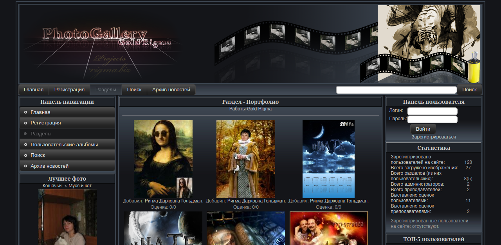

# Photo Rigma BiZ 📸


**Photo Rigma BiZ** — это **галерея изображений**, написанная на **PHP** и использующая **MySQL** для хранения данных.
Проект включает такие функции, как загрузка изображений 📤, создание альбомов 📂, оценки ⭐ и администрирование 👮‍♂️.

Особенность проекта — удобная система взаимодействия между пользователями через фотографии, что делает его идеальным для учебных заведений. Студенты и преподаватели могут оценивать работы.
В планах добавить функции комментариев и обсуждений для повышения интерактивности 💬.

Стек технологий: **PHP 8.3+**, **MySQL 5.7+**, **HTML/CSS**, **JavaScript**.
Разработан с акцентом на простоту развертывания и использования 🚀.
- [Code of Conduct](CODE_OF_CONDUCT.md)
- [Contributing](CONTRIBUTING.md)
- [Security Policy](SECURITY.md)

## 📑 Оглавление

1. 📌 [Описание проекта](#описание-проекта)
2. ✨ [Основные функции](#основные-функции)
3. 💻 [Требования к системе](#требования-к-системе)
4. 🛠️ [Установка](#установка)
5. 🎮 [Использование](#использование)
6. 🗂️ [Структура проекта](#структура-проекта)
7. 📜 [Лицензия](#лицензия)
8. 🚀 [Дополнительная информация](#дополнительная-информация)

---
<a id="описание-проекта"></a>
## 📌 Описание проекта

**Photo Rigma BiZ** предоставляет удобный интерфейс для загрузки, просмотра и управления изображениями 🖼️.

### Основные возможности:
- Пользователи могут создавать свои альбомы 📂.
- Возможность оценивать фотографии ⭐.
- Оставлять комментарии 💬 (в планах).
- Взаимодействовать с другими участниками 👥.

### Для кого предназначен?
Основная целевая аудитория — **учебные заведения** 🎓.
Проект позволяет:
- Студентам выкладывать свои работы и получать обратную связь.
- Преподавателям (модераторам) оценивать фотографии и давать рекомендации.
- Администраторам управлять контентом, пользователями и настройками платформы 👮‍♂️.



---
<a id="основные-функции"></a>
## ✨ Основные функции

### Для пользователей:
- **Загрузка изображений** 📤:
  Пользователи могут загружать изображения в свои альбомы. Поддерживаются популярные форматы, такие как JPG, PNG и GIF.

- **Пользовательские альбомы** 📂:
  Каждый пользователь может создавать и управлять своими альбомами. Альбомы можно редактировать, переименовывать или удалять.

- **Рейтинги и оценки** ⭐:
  Возможность оценивать изображения и просматривать топовые фотографии. Рейтинги помогают выделить лучшие работы.

- **Комментарии** 💬 *(в планах)*:
  Пользователи смогут оставлять комментарии к изображениям для обсуждения и обратной связи.

### Для администраторов:
- **Администрирование** 👮‍♂️:
  Администраторы могут управлять пользователями, изображениями и настройками платформы через панель администратора.

- **Защита от SQL-инъекций и XSS** 🔒:
  Встроенные механизмы защиты от вредоносных запросов обеспечивают безопасность данных.

- **Мультиязычность** 🌐:
  Поддержка нескольких языков через файлы локализации. На данный момент доступны русский и английский языки.

- **Генерация эскизов** 🖼️:
  Автоматическое создание миниатюр для загруженных изображений. Это ускоряет загрузку страниц и улучшает пользовательский опыт.

---
<a id="требования-к-системе"></a>
## 💻 Требования к системе

Для работы приложения необходимы следующие компоненты:

### Основные компоненты:
- **Операционная система**:
  Linux, macOS или Windows. Рекомендуется использовать Linux для серверной части.

- **Веб-сервер**:
  Apache или Nginx.
  [Документация Apache](https://httpd.apache.org/docs/) | [Документация Nginx](https://nginx.org/en/docs/)

- **PHP**:
  Версия **8.3.0 или выше**.
  [Документация PHP](https://www.php.net/manual/)

- **СУБД (Система управления базами данных)**:
  - **MySQL**: Версия **5.7 или выше**.
    [Документация MySQL](https://dev.mysql.com/doc/)
  - **PostgreSQL**: Версия **16+**.
    [Документация PostgreSQL](https://www.postgresql.org/docs/)
  - **SQLite**: Версия **3.9+**. Требуется поддержка **FTS5**.
    [Документация SQLite](https://www.sqlite.org/docs.html)

### Расширения PHP:
Для корректной работы приложения необходимо установить следующие расширения PHP:
- `PDO` ([документация PDO](https://www.php.net/manual/en/book.pdo.php)): Для работы с базой данных.
- `GD` ([документация GD](https://www.php.net/manual/en/book.image.php)): Для обработки изображений.
- `JSON`: Для работы с JSON-данными.
- `MBString`: Для корректной обработки строк в разных кодировках.

#### Необязательные расширения (но поддерживаются):
- `GMagick` ([документация GMagick](https://www.php.net/manual/en/book.gmagick.php)): Альтернативная библиотека для обработки изображений.
- `IMagick` ([документация IMagick](https://www.php.net/manual/en/book.imagick.php)): Ещё одна мощная библиотека для работы с изображениями.
- `Redis` ([документация Redis](https://redis.io/documentation)): Поддержка Redis для кеширования данных. Улучшает производительность за счёт быстрого доступа к данным в памяти.
- `Memcached` ([документация Memcached](https://www.php.net/manual/en/book.memcached.php)): Поддержка Memcached для кеширования данных. Аналогично Redis, используется для оптимизации работы с часто запрашиваемыми данными.

### Права доступа:
Убедитесь, что веб-сервер имеет права на запись в следующую директорию:
- `var/` — для хранения пользовательских данных.

### Рекомендации:
- Используйте HTTPS для защиты данных пользователей.
- Настройте регулярное резервное копирование базы данных.

---
<a id="установка"></a>
## 🛠️ Установка

Для установки и настройки Photo Rigma BiZ выполните следующие шаги:

---

### 1. Клонируйте репозиторий
Клонируйте репозиторий на ваш сервер или локальную машину в папку для размещения сервера:
```bash
git clone https://github.com/ddayver/Photo-Rigma-BiZ.git
cd Photo-Rigma-BiZ
```
Далее вам нужно выполнить следующую команду:
```bash
composer install
```

---

### 2. Настройте конфигурацию
Откройте файл `config/.env` и отредактируйте другие настройки:

```bash
# =================================================
# БАЗОВЫЕ НАСТРОЙКИ ПРИЛОЖЕНИЯ
# =================================================
APP_ENV=development
APP_DEBUG=true
APP_URL=http://localhost
# Критичный ключ (для шифрования, сессий, CSRF)
APP_KEY=
# Дополнительная соль (для хеширования, подписей URL)
APP_SALT=

# =================================================
# НАСТРОЙКИ БАЗЫ ДАННЫХ
# =================================================
# Доступные типы: mysql, pgsql, sqlite
DB_TYPE=sqlite

# Настройки для MySQL/PostgreSQL
DB_HOST=localhost
DB_PORT=
DB_SOCKET=/var/lib/mysql/mysql.sock
DB_USER=root
DB_PASSWORD=
DB_NAME=photorigma

# Альтернативно для SQLite:
# DB_TYPE=sqlite
# В DB_NAME указываем только имя базы данных, путь к ней не требуется.
# Базы данных будут созданы в директории проекта var/sql/sqlite/.
# DB_NAME=database

# =================================================
# НАСТРОЙКИ ПАПОК
# =================================================
GALLERY_DIR=gallery
THUMBNAIL_DIR=thumbnail
AVATAR_DIR=avatar

# =================================================
# НАСТРОЙКИ КЭШИРОВАНИЯ
# =================================================
# Типы кэша: file, redis, memcached
CACHE_TYPE=file

# Для файлового кэша:
CACHE_DIR=cache

# Для Redis/Memcached:
CACHE_HOST=127.0.0.1
CACHE_PORT=

# =================================================
# НАСТРОЙКИ ЕЖЕДНЕВНОГО ВЫПОЛНЕНИЯ
# =================================================
# Включить выполнение задач для cron.php
TASK_ENABLE=true
# Выберите тип обработчика задач (cron | systemd | manual)
TASK_TYPE=cron
# Укажите час для ежедневного выполнения задачи (0-23), используется если TASK_TYPE=cron
TASK_TIME=2

# =================================================
# ДОПОЛНИТЕЛЬНЫЕ НАСТРОЙКИ
# =================================================
# Локальный ли сервер (ограничивает загрузку внешних ресурсов)
LOCALHOST_SERVER=false
# Использование URL rewrite
URL_REWRITE=false
# Включить логирование запросов без плейсхолдеров и медленных запросов
SQL_LOG=false
# Включить анализ запросов с помощью EXPLAIN/EXPLAIN ANALYZE
SQL_ANALYZE=false
# Уровень сжатия (9 - максимальный)
COMPRESSION_LEVEL=9
# Срок хранения логов (в формате strtotime())
LOG_LIFETIME_DAYS=-7_days
# Максимальный размер лога (предварительно вычисленное значение: 10 * 1024 * 1024 = 10485760)
MAX_LOG_SIZE=10485760
# Интервал от мягкого до окончательного удаления в формате strtotime()
SOFT_DELETE_RETENTION_INTERVAL=3_months
# Значение аватара по-умолчанию
DEFAULT_AVATAR=no_avatar.jpg
# Максимальное количество попыток входа в админку
MAX_LOGIN_ATTEMPTS=5
# Время блокировки после превышения попыток входа в админку (в секундах, например, 5 минут)
LOCKOUT_TIME=300
```

> **Примечание**:
> - Замените значения `DB_USER`, `DB_PASSWORD` и `DB_NAME` на те, которые вы создали на предыдущем шаге.
> - Если используете PostgreSQL, измените параметр `DB_TYPE` на `'pgsql'`.
> - Если используете SQLite:
    >   - Установите параметр `DB_TYPE` на `'sqlite'`.
    >   - Укажите имя базы данных в параметре `DB_NAME`. Например: `DB_NAME=database`.
>   - Параметры `DB_HOST`, `DB_PORT`, `DB_SOCKET`, `DB_USER` и `DB_PASSWORD` игнорируются для SQLite.

---

### 3. Настройте базу данных
#### a) Создайте базу данных и пользователя
Для работы приложения требуется база данных. Выполните следующие шаги:

- **Для MySQL**:
  ```sql
  CREATE DATABASE photorigma;
  CREATE USER 'photorigma_user'@'localhost' IDENTIFIED BY 'secure_password';
  GRANT ALL PRIVILEGES ON photorigma.* TO 'photorigma_user'@'localhost';
  FLUSH PRIVILEGES;
  ```

- **Для PostgreSQL** *(экспериментальная поддержка)*:
  ```sql
  CREATE DATABASE photorigma;
  CREATE USER photorigma_user WITH PASSWORD 'secure_password';
  GRANT ALL PRIVILEGES ON DATABASE photorigma TO photorigma_user;
  ```

- **Для SQLite**:
  SQLite не требует создания базы данных через SQL. Просто укажите имя базы данных в конфигурации. Если файл не существует, он будет создан автоматически при первом подключении.

#### b) Импортируйте структуру базы данных
Импортируйте структуру базы данных. Для этого выполните следующие команды:
```bash
composer run build-app
```

---

### 4. Настройте права доступа
Убедитесь, что веб-сервер имеет права на запись в следующую директорию:
```bash
chmod -R 775 var/
```

---

### 5. Запустите приложение
Откройте браузер и перейдите по адресу вашего сайта, например:
```
http://localhost/
```

---

### 6. Решение проблем
Если возникли проблемы:
- Проверьте логи сервера или файлы в папке `var/log/`.
- Убедитесь, что все расширения PHP установлены и включены.
- Если используете PostgreSQL, проверьте совместимость версии и правильность настроек в `config/.env`.

---
<a id="использование"></a>
## 🎮 Использование

### 1. Регистрация и вход
- Перейдите на страницу регистрации и создайте учётную запись.
- После регистрации войдите в систему на странице входа.

> **Важно**:
> - По умолчанию в базе данных создаётся пользователь с логином `admin` и паролем `admin`.
> - После первого входа обязательно смените пароль через панель профиля пользователя.

---

### 2. Загрузка изображений
- Перейдите в свой профиль и создайте новый альбом.
- Загрузите изображения в альбом через форму загрузки.

> Поддерживаются форматы: JPG, PNG, GIF. Максимальный размер файла: 10 МБ.

---

### 3. Оценка и комментирование
- Просмотрите изображения других пользователей.
- Оцените изображение (например, по шкале от 1 до 5 звёзд).
- Оставьте комментарий (если функция комментариев включена).

---

### 4. Администрирование
- Войдите в систему как администратор.
- Управляйте пользователями, изображениями и настройками платформы через панель администратора.

> Панель администратора доступна по адресу `?action=admin`.

---

### 5. Расширение функционала
Photo Rigma BiZ поддерживает возможность добавления собственного кода для реализации новых функций. Вот как это работает:

#### a) Добавление нового обработчика
1. Создайте новый файл в папке `var/Action/`, например, `custom_action.php`.
2. Реализуйте логику обработчика в этом файле. Например:
   ```php
   <?php
   // Подключаем необходимые пространства имен
    namespace PhotoRigma\Action;

    use PhotoRigma\Classes\Work;

    // Устанавливаем файл шаблона
    $template->template_file = 'custom_template.html';

   // Пример простого обработчика
   if ($_SERVER['REQUEST_METHOD'] === 'POST') {
       $user = new User();
       $user->logAction('Custom action executed');
       echo 'Custom action completed!';
   }
   ```

#### b) Добавление HTML-шаблона (если требуется)
1. Создайте новый HTML-шаблон в папке темы оформления, например, `var/templates/default/custom_template.html`.
2. Убедитесь, что шаблон соответствует структуре текущих шаблонов.

#### c) Подключение нового кода
- Через **панель администратора** (планируется) или **базу данных** добавьте запись о новом обработчике.
- Если код написан правильно, ядро проекта автоматически "подхватит" его и интегрирует в систему.

> **Примечание**:
> - Все классы, методы и интерфейсы, предоставляемые ядром, уже доступны для использования в вашем коде.
> - Для ознакомления с текущими классами и их функционалом используйте документацию, расположенную в папке `Documentation/`.
> - Документация генерируется автоматически с помощью [phpDocumentor](https://www.phpdoc.org/). Чтобы обновить её, выполните команду:
>   ```bash
>   composer run script doc-update
>   ```

---

### 6. Типичные проблемы
Если возникли проблемы:
- Проверьте логи системы в папке `var/log/`.
- Убедитесь, что все необходимые расширения PHP включены.
- Если проблема не решена, сообщите о ней в разделе [Issues](https://github.com/ddayver/Photo-Rigma-BiZ/issues).

---
<a id="структура-проекта"></a>
## 🗂️ Структура проекта

```
photorigma-develop/
├── CHANGELOG.md                   # История изменений по версиям
├── CODE_OF_CONDUCT.md             # Правила поведения для участников
├── CONTRIBUTING.md                # Инструкция для разработчиков
├── composer.json                  # Конфиг Composer (автолоад, dev-зависимости, скрипты)
├── docker/                        # Файлы Docker для развёртки окружения
├── Documentation/                 # Документация проекта
├── LICENSE                        # Лицензия проекта (MIT)
├── LICENSE.ru                     # Русская копия лицензии
├── phpdoc.xml                     # Конфиг для генерации документации через phpDocumentor
├── phpunit.xml                    # Настройки PHPUnit
├── psalm.xml                      # Конфиг Psalm для статического анализа
├── SECURITY.md                    # Политика безопасности и отчёты о уязвимостях
├── src/                           # Исходники проекта (PSR-4)
│   ├── Classes/                   # Реализация классов проекта
│   │   ├── Bootstrap.php          # Загрузка окружения и конфига
│   │   ├── Cache_Handler.php      # Работа с кэшем
│   │   ├── Database.php           # Класс для работы с БД
│   │   ├── Template.php           # Шаблонизатор
│   │   ├── User.php               # Управление пользователями
│   │   ├── Work_CoreLogic.php     # Основная логика приложения
│   │   ├── Work_Helper.php        # Вспомогательные функции
│   │   ├── Work_Image.php         # Обработка изображений
│   │   ├── Work.php               # Главный класс приложения
│   │   ├── Work_Security.php      # Безопасность, фильтрация данных
│   │   └── Work_Template.php      # Работа с шаблонами
│   ├── Include/                   # Файлы без классов
│   │   ├── constants.php          # Глобальные константы
│   │   ├── functions.php          # Вспомогательные функции
│   │   └── session_init.php       # Инициализация сессий
│   └── Interfaces/                # Интерфейсы (для DI и тестирования)
│       ├── Bootstrap_Interface.php
│       ├── Cache_Handler_Interface.php
│       ├── Database_Interface.php
│       ├── Template_Interface.php
│       ├── User_Interface.php
│       ├── Work_CoreLogic_Interface.php
│       ├── Work_Helper_Interface.php
│       ├── Work_Image_Interface.php
│       ├── Work_Interface.php
│       ├── Work_Security_Interface.php
│       └── Work_Template_Interface.php
│
├── config/                        # Конфигурационные файлы
│   ├── config.php                 # Глобальные настройки (генерируются из .env)
│   ├── .env                       # Локальный env-файл (генерируется из .env.example)
│   └── .env.example               # Пример env-файла
│
├── core/                          # Ядро проекта: действия, темы, шаблоны, локали
│   ├── Action/                    # Обработчики действий
│   │   ├── admin.php              # Админка
│   │   ├── attach.php             # Отдача файлов
│   │   ├── category.php           # Работа с категориями
│   │   ├── cron.php               # CLI-скрипт фоновых задач
│   │   ├── main.php               # Основное ядро
│   │   ├── news.php               # Новости
│   │   ├── photo.php              # Фотографии
│   │   ├── profile.php            # Профиль пользователя
│   │   └── search.php             # Поиск
│   ├── language/                  # Файлы локализации
│   │   ├── english/
│   │   │   └── main.php           # Английский язык
│   │   └── russian/
│   │       └── main.php           # Русский язык
│   ├── Resources/                 # Ресурсы проекта
│   │   └── default_files/         # Дефолтные файлы для установки
│   │       ├── avatar/            # Аватары
│   │       │   └── no_avatar.jpg
│   │       ├── gallery/           # Галерея по умолчанию
│   │       │   └── no_foto.png
│   │       └── thumbnail/         # Миниатюры
│   │           └── no_foto.png
│   ├── templates/                 # HTML-шаблоны
│   │   └── default/               # Тема оформления по умолчанию
│   │       ├── admin.html         # Административная панель
│   │       ├── category.html      # Категории
│   │       ├── footer.html        # Подвал страницы
│   │       ├── header.html        # Заголовок
│   │       ├── main.html          # Главная страница
│   │       ├── news.html          # Новости
│   │       ├── photo.html         # Страница просмотра фото
│   │       ├── profile.html       # Профиль пользователя
│   │       └── search.html        # Поиск
│   └── themes/                    # Темы оформления
│       └── default/               # Тема по умолчанию
│           ├── css/
│           │   ├── semantic.min.css
│           │   └── style.css
│           ├── image/
│           │   ├── gpadient_big.jpg
│           │   ├── gpadient_small.jpg
│           │   ├── logo-1.png
│           │   └── logo-2.png
│           └── js/
│               ├── jquery.min.js
│               ├── script.js
│               └── semantic.min.js
│
├── public/                        # Точка входа и web-доступ
│   ├── favicon.ico                # Иконка сайта
│   ├── index.php                  # Точка входа
│   └── themes/                    # Темы оформления
│       └── default/               # Симлинк на core/themes/default
│
├── scripts/                       # CLI-скрипты
│   ├── check-env.php              # Проверяет актуальность .env
│   ├── cron.php                   # Запуск фоновых задач
│   ├── install.php                # Установка базы данных
│   ├── setup-cron.php             # Настройка ежедневного запуска
│   ├── setup-structure.php        # Создание директорий, прав, симлинков
│   ├── update-env.php             # Обновление .env из .env.example
│   ├── update.php                 # Миграции БД
│   └── cli/                       # Вспомогательные файлы
│       ├── bootstrap.php          # Общие функции для скриптов
│       └── functions.php          # Вспомогательные функции
│
├── submodule/                     # Git-подмодули (например, библиотеки)
│   └── naughty-words-js/          # Плагин для фильтрации "грязных" слов
│       ├── bin/
│       └── test/
│
├── sql/                           # SQL-скрипты для разных СУБД
│   ├── mysql/
│   │   ├── photorigma.sql         # SQL для MySQL
│   │   └── update/                # Миграции
│   │       └── ver.0.4.4.sql
│   ├── pgsql/
│   │   ├── photorigma.sql         # SQL для PostgreSQL
│   │   └── update/
│   │       └── ver.0.4.4.sql
│   ├── sqlite/
│   │   ├── photorigma.sql         # SQL для SQLite
│   │   └── update/
│   │       └── ver.0.4.4.sql
│   └── README.md                  # Как использовать SQL-файлы
│
└── var/                           # Пользовательские данные (создается в процессе установки)
    ├── Action/                    # Временные файлы действий
    ├── avatar/                    # Аватары пользователей
    ├── cache/                     # Кэшированные данные
    ├── gallery/                   # Пользовательские изображения
    ├── log/                       # Логи проекта
    ├── sql/                       # Файлы SQLite
    ├── templates/                 # Компилированные шаблоны
    └── thumbnail/                 # Миниатюры
```

---
<a id="лицензия"></a>
## 📜 Лицензия

Проект распространяется под лицензией [MIT](https://opensource.org/licenses/MIT).
Это означает, что вы можете свободно использовать, копировать, изменять, объединять, публиковать, распространять, сублицензировать и/или продавать копии программного обеспечения при соблюдении следующих условий:

- Уведомление об авторских правах и условия лицензии должны быть включены во все копии или значимые части программного обеспечения.

> Полный текст лицензии доступен в файле [LICENSE](LICENSE).
> Доступен [перевод лицензии на русский язык](LICENSE.ru).

---

### Авторство
Автор проекта: **[Dark Dayver](https://github.com/ddayver)**.
Если вы используете этот проект, пожалуйста, укажите авторство в своей документации или README.

---

### Лицензирование стороннего контента
- Список нецензурных слов взят из репозитория [naughty-words-js](https://github.com/alfinforwork/naughty-words-js) и распространяется под лицензией [Creative Commons Attribution 4.0 International (CC BY 4.0)](https://creativecommons.org/licenses/by/4.0/).
- Авторство списка принадлежит его создателям. Если вы используете этот список, пожалуйста, укажите источник и лицензию.
- Этот проект использует открытые библиотеки, которые могут иметь собственные лицензии:
- Все зависимости используют совместимые MIT, BSD, Apache или ISC лицензии.
- Полный список лицензий можно получить через команду:
```bash
composer license
```

---

### Рекомендации по использованию
Если вы используете Photo Rigma BiZ в своих проектах:
- Убедитесь, что вы соблюдаете условия лицензии MIT.
- Укажите ссылку на оригинальный репозиторий: [https://github.com/ddayver/Photo-Rigma-BiZ](https://github.com/ddayver/Photo-Rigma-BiZ).

---
<a id="дополнительная-информация"></a>
## 🚀 Дополнительная информация

### Связь с автором
Если у вас есть вопросы, предложения или вы хотите сообщить об ошибке, используйте следующие способы связи:
- Создайте issue в репозитории: [Issues](https://github.com/ddayver/Photo-Rigma-BiZ/issues).
- Напишите в GitHub Discussions: [Discussions](https://github.com/ddayver/Photo-Rigma-BiZ/discussions).

> Примечание: Пожалуйста, не используйте другие способы связи, кроме GitHub.

---

### Благодарности
- Особая благодарность жене, которая разработала шаблон и помогает тестировать и улучшать проект.
- Помощь черпалась из следующих проектов:
  - [naughty-words-js](https://github.com/alfinforwork/naughty-words-js) — список нецензурных слов.

---

### Планы
Мы активно работаем над улучшением Photo Rigma BiZ. В планах:
- Добавление функции комментариев.
- Создание API для расширения функционала.
- Интеграция с социальными сетями.
